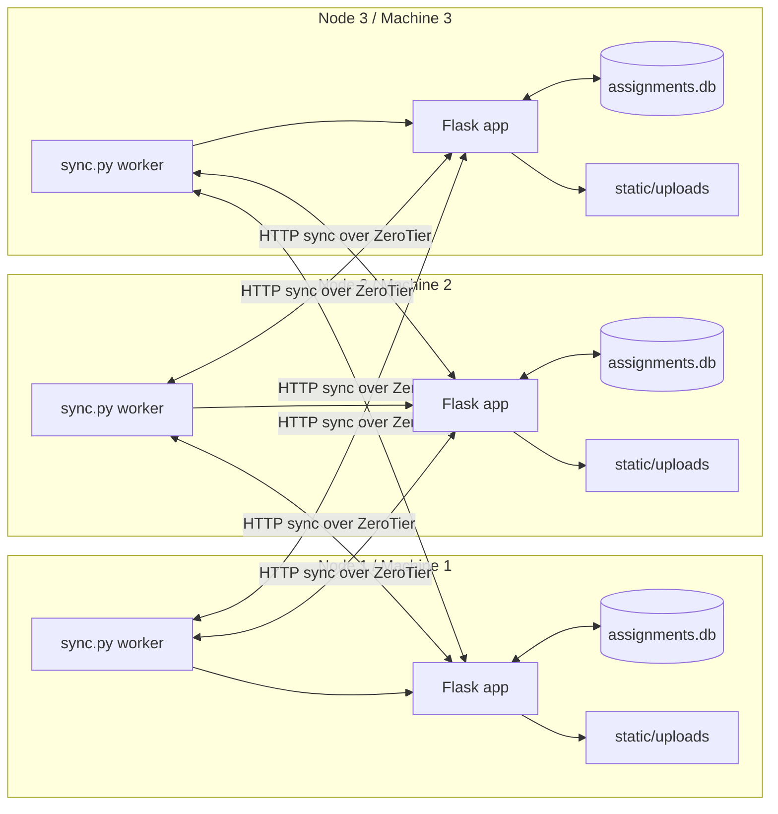
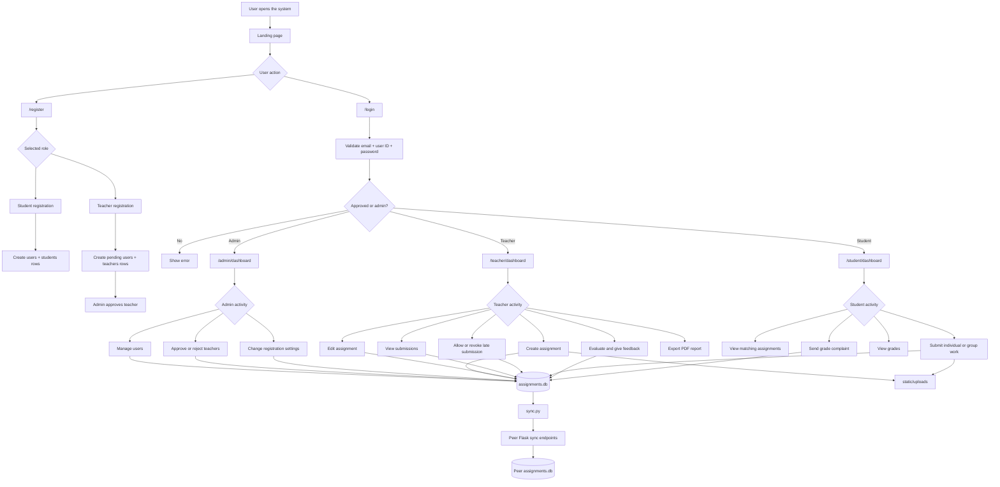
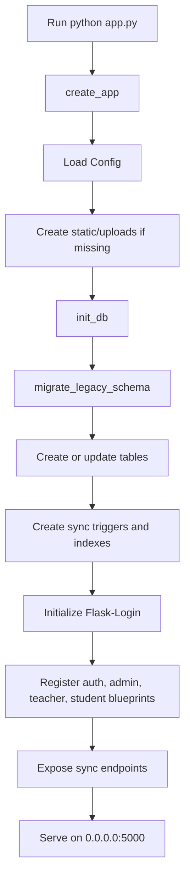
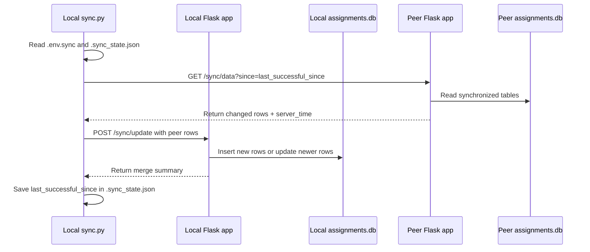
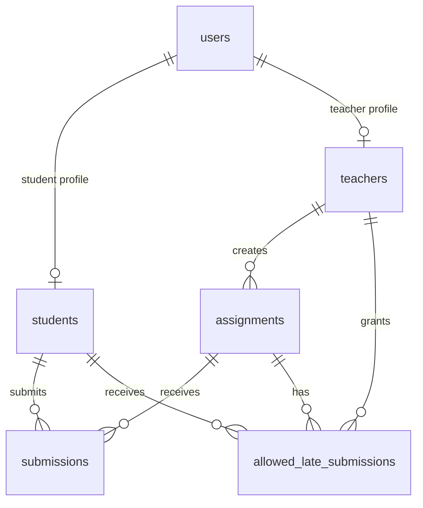
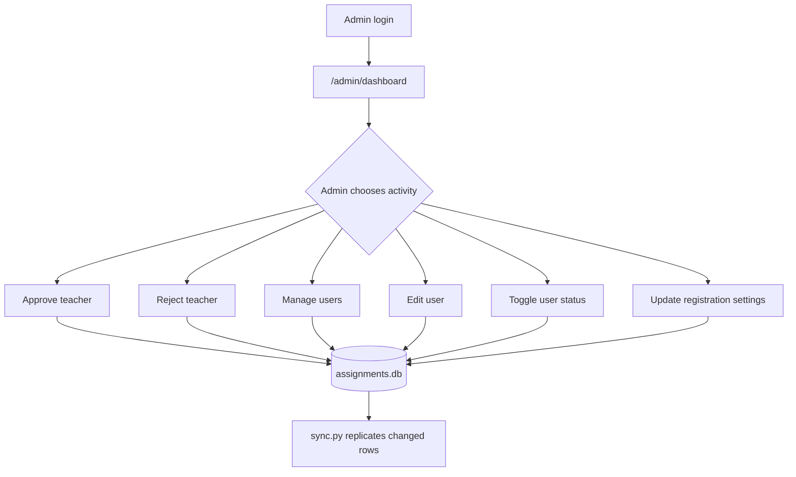
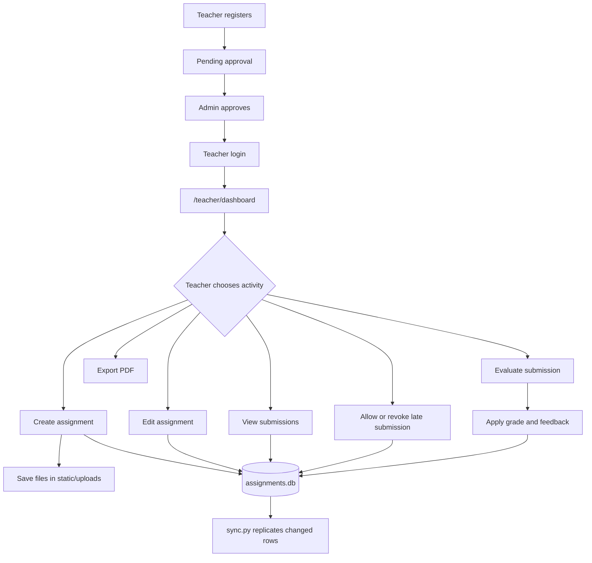
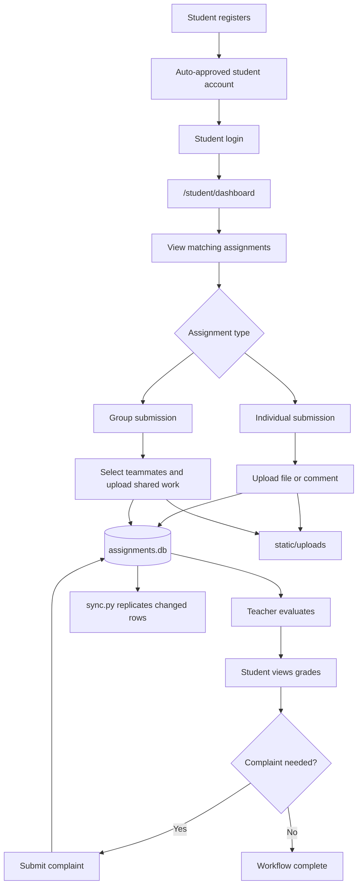

# Distributed Assignment Submission and Evaluation System

This project is a distributed Flask-based assignment management system for admins, teachers, and students. Each machine runs the same application, keeps its own local SQLite database, stores uploaded files locally, and synchronizes database changes with peer machines over HTTP.

The system is explicitly a distributed system because it has multiple independent nodes, each with its own application process and local database, connected through a network such as ZeroTier. The nodes exchange updates through `/sync/data` and `/sync/update` so users on different machines can share the same academic workflow.

## Main Roles

- `admin`: manages registration settings, users, and teacher approvals.
- `teacher`: creates assignments, manages late permissions, evaluates submissions, responds to complaints, and exports PDF reports.
- `student`: registers, views assigned work, submits individual or group assignments, checks grades, and sends grade complaints.

## Distributed System Diagram



Important distributed-system properties:

- Replication: important tables are copied between peer nodes.
- Local autonomy: each node can serve local users from its own `assignments.db`.
- Peer communication: synchronization happens through HTTP endpoints.
- Node identity: `NODE_ID` or the hostname marks which node created or updated rows.
- Incremental sync: `.sync_state.json` stores the last successful sync time for each peer.
- Conflict handling: when the same row exists on multiple nodes, the row with the newer `updated_at` timestamp wins.
- UUID keys: most tables use UUIDs to reduce ID collisions when different machines create records at the same time.

Limitation: this is not a full distributed database. It uses timestamp-based conflict handling, so simultaneous edits to the same row can overwrite one another if one update has a newer timestamp.

## Project Structure

```text
assignment-system/
├── .env.sync
├── .sync_state.json
├── README.md
├── app.py
├── auth.py
├── config.py
├── node_discovery.py
├── routes_admin.py
├── routes_student.py
├── routes_teacher.py
├── setup_admin.py
├── sync.py
├── assignments.db
├── assignments.db.backup
├── templates/
│   ├── landing.html
│   ├── login.html
│   ├── register.html
│   ├── admin_base.html
│   ├── teacher_base.html
│   ├── student_base.html
│   ├── admin/
│   │   ├── dashboard.html
│   │   ├── edit_user.html
│   │   ├── settings.html
│   │   └── users.html
│   ├── teacher/
│   │   ├── create_assignment.html
│   │   ├── dashboard.html
│   │   ├── edit_assignment.html
│   │   ├── evaluate.html
│   │   └── submissions.html
│   └── student/
│       ├── dashboard.html
│       ├── grades.html
│       └── submit.html
├── static/
│   └── uploads/
├── assignment-system-backup/
├── venv/
└── __pycache__/
```

## Folders and Files

| Path | Importance |
| --- | --- |
| `app.py` | Main Flask entry point. Creates the app, initializes the database, registers route blueprints, and exposes sync endpoints. |
| `auth.py` | Handles registration, login, logout, registration availability, and Flask-Login user loading. |
| `config.py` | Central location for app settings such as secret key, database URI, upload folder, and upload size behavior. |
| `routes_admin.py` | Contains all admin pages and admin actions. |
| `routes_teacher.py` | Contains all teacher pages and teacher assignment/evaluation actions. |
| `routes_student.py` | Contains all student pages and student submission/grade actions. |
| `sync.py` | Background peer synchronization worker. Pulls data from peer nodes and posts it to the local node. |
| `node_discovery.py` | Helper script for finding local IPs, testing peer connectivity, and creating `.env.sync`. |
| `setup_admin.py` | Creates the first default admin user when the system is initialized. |
| `assignments.db` | Local SQLite database used by this node. Each distributed node has its own copy. |
| `assignments.db.backup` | Backup made during schema migration from older database formats. |
| `.env.sync` | Optional sync configuration file containing peers, node ID, local URL, timeout, and interval settings. |
| `.sync_state.json` | Generated sync state file that stores the last successful sync time and errors per peer. |
| `README.md` | Project documentation. |
| `templates/` | HTML templates rendered by Flask. |
| `templates/admin/` | Admin-specific pages. |
| `templates/teacher/` | Teacher-specific pages. |
| `templates/student/` | Student-specific pages. |
| `static/uploads/` | Stores assignment files uploaded by teachers and submission files uploaded by students. |
| `assignment-system-backup/` | Backup copy of the application, database, templates, and uploaded files. Useful for recovery, not part of the active runtime path. |
| `venv/` | Python virtual environment and installed packages. Generated dependency folder. |
| `__pycache__/` | Python bytecode cache generated automatically. Not part of project logic. |

## Template Files

| Template | Used by | Importance |
| --- | --- | --- |
| `templates/landing.html` | `app.py:index()` | Public landing page at `/`. |
| `templates/login.html` | `auth.py:login()` | Login form for all roles. |
| `templates/register.html` | `auth.py:register()` | Registration form for students and teachers. |
| `templates/admin_base.html` | Admin pages | Shared layout/navigation for admin pages. |
| `templates/teacher_base.html` | Teacher pages | Shared layout/navigation for teacher pages. |
| `templates/student_base.html` | Student pages | Shared layout/navigation for student pages and reminder notifications. |
| `templates/admin/dashboard.html` | `routes_admin.py:dashboard()` | Admin statistics, pending teachers, approved teachers, and settings summary. |
| `templates/admin/users.html` | `routes_admin.py:manage_users()` | User list and filters. |
| `templates/admin/edit_user.html` | `routes_admin.py:edit_user()` | Admin form for editing user profile and approval state. |
| `templates/admin/settings.html` | `routes_admin.py:settings()` | Registration control page. |
| `templates/teacher/dashboard.html` | `routes_teacher.py:dashboard()` | Teacher assignment and submission summary. |
| `templates/teacher/create_assignment.html` | `routes_teacher.py:create_assignment()` | Assignment creation form. |
| `templates/teacher/edit_assignment.html` | `routes_teacher.py:edit_assignment()` | Assignment update form. |
| `templates/teacher/submissions.html` | `routes_teacher.py:view_submissions()` | Submitted, missing, grouped, and late-permission submission view. |
| `templates/teacher/evaluate.html` | `routes_teacher.py:evaluate()` | Grading and feedback page. |
| `templates/student/dashboard.html` | `routes_student.py:dashboard()` | Student assignment list, reminders, and submission status. |
| `templates/student/submit.html` | `routes_student.py:submit()` | Individual and group submission form. |
| `templates/student/grades.html` | `routes_student.py:grades()` | Grade, feedback, complaint, and effective-score view. |

## Upload Files

`static/uploads/` contains runtime user files. The exact filenames change as users upload assignments and submissions.

Teacher assignment files use this pattern:

```text
<timestamp>_<original_filename>
```

Student submission files use this pattern:

```text
sub_<timestamp>_<original_filename>
```

These files are important because database rows only store the filenames. The real uploaded documents are stored in this folder.

## Application Flow Diagram



## Startup Flow



## Synchronization Flow



## Database Relationship Diagram



## Main Database Tables

| Table | Importance |
| --- | --- |
| `users` | Login identity, names, email, password hash, role, approval status, timestamps, and node identity. |
| `students` | Student profile connected to `users`, including department and year. |
| `teachers` | Teacher profile connected to `users`, including departments, years, and courses. |
| `assignments` | Assignment details, target department/year, deadline, late rules, score, group settings, teacher comments, and files. |
| `submissions` | Student work, uploaded files, comments, grades, feedback, evaluation state, complaints, group IDs, and timestamps. |
| `allowed_late_submissions` | Special late-submission permission for selected students. |
| `system_settings` | Registration settings such as student/teacher registration switches and registration start/end dates. |

## Main Functions by File

### `app.py`

| Function | Importance |
| --- | --- |
| `now_utc_iso()` | Produces UTC timestamps for sync responses. |
| `get_node_id()` | Reads `NODE_ID` or uses hostname to identify the current distributed node. |
| `generate_id()` | Creates UUID values for distributed-safe primary keys. |
| `migrate_legacy_schema()` | Detects old integer-ID databases, creates `assignments.db.backup`, and prepares the UUID schema. |
| `init_db()` | Creates/migrates tables, fills sync metadata, creates triggers, and adds indexes for incremental synchronization. |
| `create_app()` | Builds the Flask app, initializes storage, registers blueprints, and defines local sync helper routes. |
| `index()` | Renders the public landing page. Defined inside `create_app()`. |
| `_table_exists()` | Checks whether a table exists before sync reads or merges. |
| `_table_columns()` | Reads SQLite table schema for flexible sync logic. |
| `_parse_sync_ts()` | Converts sync timestamps into comparable UTC datetimes. |
| `_filter_rows_since()` | Returns only rows newer than the requested sync timestamp. |
| `_rows_as_dicts()` | Converts SQLite rows into JSON-friendly dictionaries. |
| `_normalize_incoming_row()` | Accepts incoming sync rows as dictionaries or lists and normalizes them for merging. |
| `_merge_table_rows()` | Inserts missing rows and updates local rows only when incoming data is newer. |
| `sync_data()` | Implements `GET /sync/data` for peer nodes to fetch local changed rows. |
| `sync_update()` | Implements `POST /sync/update` for receiving and merging peer rows. |

### `auth.py`

| Function | Importance |
| --- | --- |
| `get_db()` | Opens `assignments.db` with row objects for authentication queries. |
| `get_system_settings()` | Reads registration settings from the database. |
| `registration_allowed(role)` | Enforces student/teacher registration switches and date ranges. |
| `load_user(user_id)` | Rebuilds the logged-in user object for Flask-Login. |
| `register()` | Handles student and teacher registration, validation, password hashing, and profile row creation. |
| `login()` | Verifies credentials and redirects each approved user to the correct role dashboard. |
| `logout()` | Ends the session and redirects to login. |

### `routes_admin.py`

| Function | Importance |
| --- | --- |
| `get_db()` | Opens the database for admin pages. |
| `dashboard()` | Shows system counts, departments, years, pending teachers, approved teachers, and registration settings. |
| `approve(user_id)` | Approves a teacher account so the teacher can log in. |
| `reject(user_id)` | Deletes a pending teacher profile and user account. |
| `manage_users()` | Lists and filters users by role, year, and department. |
| `edit_user(user_id)` | Allows admin updates to names, email, password, approval status, and role-specific profile data. |
| `toggle_user(user_id)` | Enables or disables a user account by changing `is_approved`. |
| `settings()` | Saves registration switches and registration start/end dates. |

### `routes_teacher.py`

| Function | Importance |
| --- | --- |
| `get_db()` | Opens the database for teacher pages. |
| `sync_timestamp()` | Generates a timestamp used when grading updates need explicit sync metadata. |
| `get_node_id()` | Identifies the current node when grading updates are saved. |
| `dashboard()` | Shows teacher statistics, overdue assignments, and assignment list. |
| `create_assignment()` | Validates and creates assignments, saves teacher-uploaded files, and stores late/group settings. |
| `edit_assignment(assignment_id)` | Updates assignment details and optionally replaces uploaded assignment files. |
| `view_submissions(assignment_id)` | Shows submissions, group members, missing students, and late permissions. |
| `manage_late(assignment_id)` | Allows or revokes late-submission permission for selected students. |
| `get_stats(assignment_id)` | Returns JSON submission and grading statistics for an assignment. |
| `evaluate(submission_id)` | Grades submissions, calculates late penalties, applies group grades, stores feedback, and marks complaints responded. |
| `export_pdf(assignment_id)` | Generates a PDF submission report using ReportLab. |
| `download_file(filename)` | Downloads assignment or submission files from `static/uploads`. |

### `routes_student.py`

| Function | Importance |
| --- | --- |
| `get_db()` | Opens the database for student pages. |
| `student_notifications()` | Supplies due-soon and late-available reminders to student templates. |
| `dashboard()` | Lists assignments matching the student's department/year and calculates status counts and effective values. |
| `submit(assignment_id)` | Handles individual and group submissions, file uploads, comments, late rules, group limits, and updates before evaluation. |
| `grades()` | Shows grades, feedback, complaint status, and effective maximum scores after late penalties. |
| `complain(submission_id)` | Stores a student's grade complaint and marks it pending. |

### `sync.py`

| Function | Importance |
| --- | --- |
| `load_env_file(filename='.env.sync')` | Reads sync settings from `.env.sync`. |
| `utc_now_iso()` | Creates UTC timestamps for sync state. |
| `parse_sync_ts(value)` | Parses timestamp strings used by sync state. |
| `since_with_overlap(last_since)` | Adds a small overlap to avoid missing rows near sync boundaries. |
| `normalize_peer(value)` | Converts peer addresses into full HTTP URLs. |
| `load_state(path)` | Reads `.sync_state.json`. |
| `save_state(path, state)` | Writes sync state safely through a temporary file. |
| `count_records(sync_payload)` | Counts returned records for sync logging. |
| `sync_once(peer_url, last_since)` | Performs one peer sync: fetch remote rows, post them locally, and return a merge summary. |
| `parse_args()` | Reads peer addresses from command-line arguments. |
| `get_peers(args)` | Combines peers from command-line args, environment variables, and `.env.sync`. |
| `main()` | Runs the continuous synchronization loop and logs success or failure for every peer. |

### `node_discovery.py`

| Function | Importance |
| --- | --- |
| `get_local_ips()` | Finds local IP addresses that may be used for node communication. |
| `test_node_connectivity(ip, port=5000)` | Checks whether a peer is reachable on the Flask port. |
| `load_current_config()` | Reads existing `.env.sync` settings. |
| `save_config(config)` | Writes sync configuration to `.env.sync`. |
| `main()` | Displays node/network information and supports interactive configuration and peer tests. |

### `setup_admin.py`

| Function | Importance |
| --- | --- |
| `setup_admin()` | Creates the first admin user if no admin exists. |

Default admin created by `setup_admin.py`:

```text
Email: admin@system.com
User ID: ADMIN001
Password: admin123
```

Change this password after first login.

### `config.py`

| Setting | Importance |
| --- | --- |
| `SECRET_KEY` | Protects Flask sessions and flash messages. |
| `SQLALCHEMY_DATABASE_URI` | Database URI setting kept for compatibility, although this app currently uses direct `sqlite3`. |
| `SQLALCHEMY_TRACK_MODIFICATIONS` | Compatibility setting; SQLAlchemy is not actively used. |
| `UPLOAD_FOLDER` | Absolute path to `static/uploads`. |
| `MAX_CONTENT_LENGTH` | Upload size limit. `None` means Flask does not enforce a fixed max upload size here. |

## Role Workflows

### Admin Activity Flow



### Teacher Activity Flow



### Student Activity Flow



## Running the System

Install dependencies:

```bash
python3 -m venv venv
source venv/bin/activate
pip install Flask Flask-Login requests reportlab
```

Start the Flask app on each machine:

```bash
python app.py
```

Create the default admin if needed:

```bash
python setup_admin.py
```

Configure peer nodes:

```bash
python node_discovery.py --configure
```

Start synchronization:

```bash
python sync.py
```

Or pass peers directly:

```bash
python sync.py 10.49.210.216:5000 10.49.210.76:5000
```

## Example Three-Machine ZeroTier Setup

1. Install ZeroTier on all three machines.
2. Join all machines to the same ZeroTier network.
3. Confirm every machine can ping the other machines through ZeroTier IPs.
4. Run `python app.py` on every machine.
5. Open firewall access for port `5000` if needed.
6. Set `SYNC_PEERS` on each machine to the other two machines.
7. Run `python sync.py` on every machine.

Example `.env.sync` for Machine 1:

```env
NODE_ID=machine-1
SYNC_PEERS=10.49.210.76:5000,10.49.210.99:5000
SYNC_INTERVAL_SEC=5
SYNC_TIMEOUT_SEC=10
SYNC_LOCAL_URL=http://127.0.0.1:5000
SYNC_STATE_FILE=.sync_state.json
```

Machine 2 and Machine 3 should use their own `NODE_ID` values and list the other machines as peers.

## Notes for Future Improvement

- Add stronger conflict resolution for simultaneous edits on different nodes.
- Add file synchronization or shared object storage if uploaded files must also replicate automatically.
- Add file type validation and upload size limits.
- Add automated tests for authentication, assignment creation, group submissions, late penalties, grading, complaints, and sync.
- Move repeated SQLite access patterns into shared helper functions if the project grows.
- Use a production WSGI server and reverse proxy for deployment outside development.
