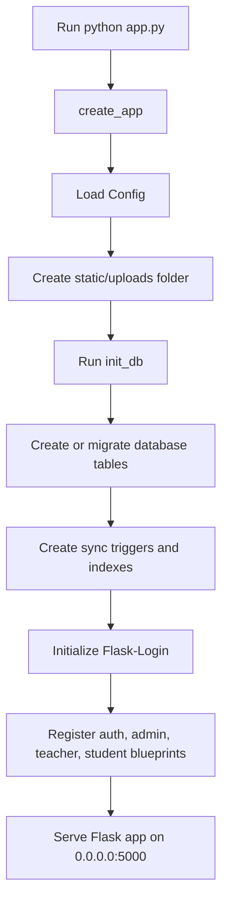
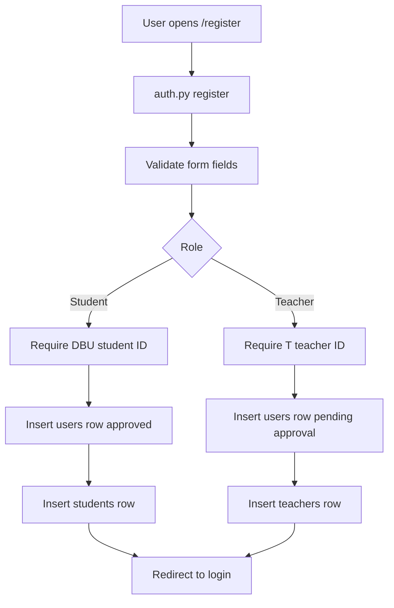
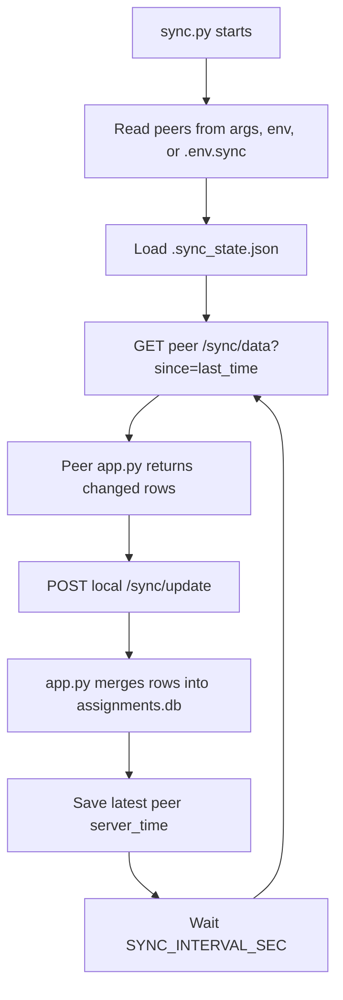
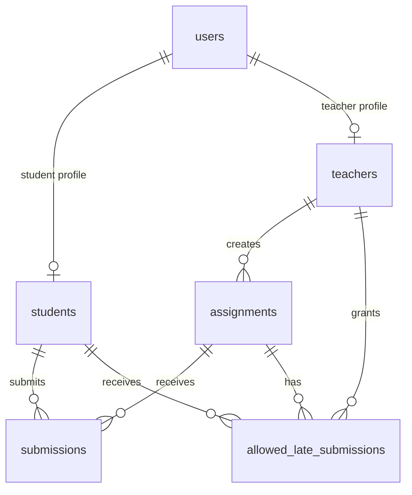

# Distributed Assignment Submission and Evaluation System

This project is a distributed Flask web application for assignment submission, evaluation, and academic user management. It is intended to run on three different machines connected through ZeroTier. Each machine runs the same Flask application, stores its own local SQLite database, and synchronizes changes with peer machines through HTTP sync endpoints.

The system supports three roles:

- `admin` manages users, approves teachers, and controls registration settings.
- `teacher` creates assignments, reviews submissions, allows late submissions, grades work, and exports reports.
- `student` views assignments, submits work, checks grades, and sends grade complaints.

## Distributed System Overview

The application is distributed because the same system runs on multiple networked machines instead of depending on one central server. In this project, the expected setup is:

- Three machines connected through a ZeroTier virtual private network.
- One copy of this Flask application running on each machine.
- One local `assignments.db` SQLite database on each machine.
- One `sync.py` worker on each machine that communicates with peer nodes.
- HTTP endpoints in `app.py` that send and receive changed database rows.

Example deployment:

```text
ZeroTier Network

┌──────────────────────────┐       ┌──────────────────────────┐
│ Machine 1                │       │ Machine 2                │
│ Flask app :5000          │◄─────►│ Flask app :5000          │
│ assignments.db           │ sync  │ assignments.db           │
│ sync.py                  │       │ sync.py                  │
└─────────────┬────────────┘       └─────────────┬────────────┘
              │                                  │
              │              sync                │
              ▼                                  ▼
        ┌──────────────────────────┐
        │ Machine 3                │
        │ Flask app :5000          │
        │ assignments.db           │
        │ sync.py                  │
        └──────────────────────────┘
```

Distributed-system features shown by this project:

- Replication: every node keeps a local copy of important system data.
- Peer communication: nodes exchange data through `/sync/data` and `/sync/update`.
- Local availability: a machine can continue serving its local users even if another node is temporarily unreachable.
- Node identity: `NODE_ID` or the hostname identifies which machine stamped a row.
- Incremental synchronization: `sync.py` remembers the last successful sync time and requests newer changes.
- Conflict reduction: UUID primary keys reduce ID collisions between machines.
- Simple conflict handling: newer `updated_at` values win when the same row exists on two nodes.

Important limitation: this is not a full distributed database with advanced conflict resolution. If two machines update the same row at nearly the same time, the row with the newer `updated_at` timestamp can overwrite the older one during sync.

## Main Features

- Student registration and automatic approval.
- Teacher registration with admin approval.
- Admin dashboard with user counts, teacher approval, and settings.
- Assignment creation with file attachments.
- Individual and group submissions.
- Late-submission control and per-day score penalty.
- Teacher grading, feedback, and complaint response status.
- Student grade viewing and complaint submission.
- PDF export for assignment submissions.
- Peer-to-peer synchronization across ZeroTier-connected nodes.

## Current Project Structure

```text
assignment-system/
├── app.py
├── auth.py
├── config.py
├── routes_admin.py
├── routes_teacher.py
├── routes_student.py
├── sync.py
├── setup_admin.py
├── node_discovery.py
├── assignments.db
├── assignments.db.backup
├── README.md
├── templates/
│   ├── landing.html
│   ├── login.html
│   ├── register.html
│   ├── admin_base.html
│   ├── teacher_base.html
│   ├── student_base.html
│   ├── admin/
│   │   ├── dashboard.html
│   │   ├── edit_user.html
│   │   ├── settings.html
│   │   └── users.html
│   ├── teacher/
│   │   ├── create_assignment.html
│   │   ├── dashboard.html
│   │   ├── edit_assignment.html
│   │   ├── evaluate.html
│   │   └── submissions.html
│   └── student/
│       ├── dashboard.html
│       ├── grades.html
│       └── submit.html
├── static/
│   └── uploads/
├── venv/
└── __pycache__/
```

Note: `models.py` has been removed. The running system does not depend on it because the application uses direct `sqlite3` database queries.

## File Relationship Diagram

```mermaid
flowchart TD
    A[python app.py] --> B[create_app]
    B --> C[Config from config.py]
    B --> D[init_db in app.py]
    B --> E[login_manager from auth.py]
    B --> F[auth_bp from auth.py]
    B --> G[admin_bp from routes_admin.py]
    B --> H[teacher_bp from routes_teacher.py]
    B --> I[student_bp from routes_student.py]
    D --> J[assignments.db]
    F --> J
    G --> J
    H --> J
    I --> J
    H --> K[static/uploads]
    I --> K
    L[sync.py] --> M[/sync/data in app.py]
    L --> N[/sync/update in app.py]
    M --> J
    N --> J
```

## Application Startup Flow



## Login and Registration Flow

```mermaid
flowchart TD
    A[User opens /login] --> B[auth.py login]
    B --> C[Check email, user_id, password]
    C --> D[Read users table]
    D --> E{Valid and approved?}
    E -- Admin --> F[/admin/dashboard]
    E -- Teacher --> G[/teacher/dashboard]
    E -- Student --> H[/student/dashboard]
    E -- No --> I[Show flash error]
```



## Synchronization Flow



## Root Files and Their Importance

### `app.py`

This is the main application file. It starts Flask, creates the database schema, connects all route files, and exposes synchronization endpoints. Without this file, the system cannot run.

Important imports:

- `Flask`, `render_template`, `request`, and `jsonify` are used for the web application and sync API.
- `Config` from `config.py` loads app settings.
- `auth_bp`, `admin_bp`, `teacher_bp`, and `student_bp` connect the other route files to the main app.
- `sqlite3` manages the local database.
- `socket`, `datetime`, and `uuid` support distributed node identity, timestamps, and globally unique IDs.

Important constants:

- `SYNC_TABLES` lists tables that are synchronized across machines.
- `LOCAL_NODE_ID` stores the current node identity.

Functions and importance:

- `now_utc_iso()` returns the current UTC time in ISO format. It is used by sync responses.
- `get_node_id()` reads `NODE_ID` from the environment or uses the machine hostname. This helps identify which distributed node produced data.
- `generate_id()` creates UUID values. UUIDs are important because three machines can create records independently without using the same ID.
- `migrate_legacy_schema()` checks whether an old integer-ID database exists. If found, it backs up `assignments.db` and drops old tables so the UUID schema can be created.
- `init_db()` creates all database tables, adds missing columns to older databases, fills missing sync metadata, creates triggers, and creates indexes for synchronization.
- `create_app()` builds the Flask app, loads config, creates the upload folder, initializes the database, connects Flask-Login, registers all blueprints, and defines sync routes.

Functions inside `create_app()`:

- `index()` renders `templates/landing.html` for the `/` route.
- `_table_exists(cur, table_name)` checks whether a table exists before syncing it.
- `_table_columns(cur, table_name)` reads SQLite column information.
- `_parse_sync_ts(value)` converts different timestamp formats into Python datetime objects for comparison.
- `_rows_as_dicts(rows, col_names)` converts SQLite rows into JSON-friendly dictionaries.
- `_normalize_incoming_row(row, col_names)` accepts incoming sync rows as dictionaries or lists and normalizes them.
- `_merge_table_rows(cur, table_name, incoming_rows)` inserts new rows and updates existing rows only when the incoming row has a newer `updated_at`.
- `sync_data()` handles `GET /sync/data`. It returns table data to peer machines.
- `sync_update()` handles `POST /sync/update`. It receives peer data and merges it into the local database.

### `config.py`

This file centralizes application configuration. It is imported by `app.py`, `routes_teacher.py`, and `routes_student.py`.

Class and definitions:

- `Config` is a configuration class used by Flask.
- `SECRET_KEY` protects sessions and flash messages.
- `SQLALCHEMY_DATABASE_URI` remains as a database URI setting, but the current system uses direct SQLite access.
- `SQLALCHEMY_TRACK_MODIFICATIONS` is harmless but not important now because SQLAlchemy is not used.
- `UPLOAD_FOLDER` points to `static/uploads`, where teacher and student files are saved.
- `MAX_CONTENT_LENGTH = None` means upload size is not limited by Flask configuration.

Importance: this file prevents hardcoding important paths and settings throughout the app.

### `auth.py`

This file handles authentication and user registration. It defines `auth_bp`, which is registered by `app.py`.

Important imports:

- Flask helpers render pages, redirect users, build URLs, and show flash messages.
- Flask-Login handles sessions through `login_user`, `logout_user`, `login_required`, and `current_user`.
- `sqlite3` reads and writes users.
- `uuid` creates distributed-safe IDs.

Functions and importance:

- `get_db()` opens `assignments.db` and returns rows as dictionary-like objects.
- `load_user(user_id)` is called by Flask-Login on each logged-in request. It rebuilds the current user object from the `users` table.
- `register()` handles `GET` and `POST` for `/register`. It validates names, email, password, user ID, role, student profile data, and teacher profile data. It inserts rows into `users`, `students`, or `teachers`.
- `login()` handles `GET` and `POST` for `/login`. It verifies email, user ID, password hash, and approval status, then redirects the user by role.
- `logout()` logs out the current user and redirects to login.

Registration relationship:

- Student registration writes to `users` and `students`.
- Teacher registration writes to `users` and `teachers`, but teacher login is blocked until admin approval.
- Admin users are normally created by `setup_admin.py`.

### `routes_admin.py`

This file handles admin-only pages. It defines `admin_bp`, which is registered by `app.py` under `/admin`.

Functions and importance:

- `get_db()` opens the SQLite database for admin routes.
- `dashboard()` shows admin statistics, pending teachers, approved teachers, department/year lists, and registration settings.
- `approve(user_id)` changes a teacher account to approved so the teacher can log in.
- `reject(user_id)` deletes a pending teacher's teacher profile and user account.
- `manage_users()` lists users and supports filtering by role, year, and department.
- `edit_user(user_id)` allows the admin to update user names, email, password, approval status, and role-specific profile data.
- `toggle_user(user_id)` switches a user's `is_approved` value on or off.
- `settings()` saves and displays registration settings such as `reg_student` and `reg_teacher`.

Importance: this file gives the admin control over user access and system policy.

### `routes_teacher.py`

This file handles teacher-only pages. It defines `teacher_bp`, which is registered by `app.py` under `/teacher`.

Functions and importance:

- `get_db()` opens the SQLite database for teacher routes.
- `dashboard()` shows teacher statistics such as total assignments, total submissions, unevaluated submissions, overdue assignments, and assignment lists.
- `create_assignment()` creates a new assignment. It validates form data, checks the deadline, saves assignment files, supports max score, late penalty, and group assignment settings.
- `edit_assignment(assignment_id)` updates assignment details and optionally replaces attached files.
- `view_submissions(assignment_id)` shows all submissions for one assignment. It groups group submissions by `group_id` and also lists students who have not submitted.
- `manage_late(assignment_id)` allows or revokes late-submission permission for selected students.
- `get_stats(assignment_id)` returns JSON statistics for an assignment, including submitted, not submitted, evaluated, late, average grade, and student status data.
- `evaluate(submission_id)` grades a submission. It calculates the effective maximum score after late penalties and applies grades to all group members when `group_id` exists.
- `export_pdf(assignment_id)` creates a PDF report for assignment submissions using ReportLab.
- `download_file(filename)` lets teachers download uploaded assignment or submission files from `static/uploads`.

Importance: this file contains the academic workflow for creating assignments and evaluating student work.

### `routes_student.py`

This file handles student-only pages. It defines `student_bp`, which is registered by `app.py` under `/student`.

Functions and importance:

- `get_db()` opens the SQLite database for student routes.
- `student_notifications()` is a context processor. It automatically provides reminder data to student templates, including assignments due soon and late assignments still available for submission.
- `dashboard()` shows assignments that match the student's department and year. It also calculates submitted, unsubmitted, overdue counts, reminders, and current effective assignment values.
- `submit(assignment_id)` handles assignment submission. It supports file uploads, comments, updates before evaluation, late submission rules, group member selection, group size limits, and shared `group_id` creation.
- `grades()` shows submitted assignments, grades, feedback, complaint status, and effective maximum score after late penalties.
- `complain(submission_id)` saves a student's complaint and marks it as pending.

Importance: this file contains the student workflow from viewing assignments to submitting work and checking grades.

### `sync.py`

This is the synchronization worker. It is run separately from the Flask app on each machine.

Functions and importance:

- `load_env_file(filename='.env.sync')` reads sync settings from `.env.sync`.
- `utc_now_iso()` returns the current UTC time for sync state.
- `normalize_peer(value)` converts peer addresses like `10.49.210.216:5000` into full URLs like `http://10.49.210.216:5000`.
- `load_state(path)` reads `.sync_state.json`, which stores the last successful sync timestamp per peer.
- `save_state(path, state)` safely writes sync state to disk.
- `count_records(sync_payload)` counts how many records were returned by a peer.
- `sync_once(peer_url, last_since)` performs one sync operation: get data from peer, post it to local `/sync/update`, and return a summary.
- `parse_args()` reads command-line peer arguments.
- `get_peers(args)` combines peers from command-line arguments, environment variables, and `.env.sync`.
- `main()` runs the infinite sync loop, logs success/failure, saves sync state, and waits between sync attempts.

Importance: this file is what makes the project distributed instead of single-machine only.

### `setup_admin.py`

This script creates the first admin user.

Functions and importance:

- `setup_admin()` checks whether an admin already exists. If not, it creates a UUID admin user, hashes the default password, and inserts it into `users`.

Default admin:

```text
Email: admin@system.com
User ID: ADMIN001
Password: admin123
```

Importance: without an admin account, teacher approval and system management cannot begin.

### `node_discovery.py`

This script helps configure the distributed network.

Functions and importance:

- `get_local_ips()` lists available local IP addresses.
- `test_node_connectivity(ip, port=5000)` checks whether another node can be reached on the Flask port.
- `load_current_config()` reads `.env.sync`.
- `save_config(config)` writes `.env.sync`.
- `main()` displays local addresses, current sync config, configuration instructions, and handles `--configure` and `--test-peer`.

Importance: this file helps set up ZeroTier peer addresses and verify that the three machines can communicate.

### `assignments.db`

This is the local SQLite database. Each machine has its own copy.

Important tables:

- `users` stores login information, names, email, password hash, role, approval status, timestamps, and node ID.
- `students` stores student department and year.
- `teachers` stores teacher departments, years, and courses.
- `assignments` stores assignment details, deadline, teacher, course, files, late rules, max score, and group settings.
- `submissions` stores student work, uploaded files, comments, grades, feedback, status, complaints, and group IDs.
- `allowed_late_submissions` stores teacher-approved late-submission exceptions.
- `system_settings` stores settings such as student and teacher registration status.

Importance: it is the main data store for each node.

### `assignments.db.backup`

This is a backup database file created during schema migration.

Importance: it protects old data when the system migrates from an older database structure.

### `.env.sync`

This optional file stores sync configuration.

Example:

```env
SYNC_PEERS=10.49.210.216:5000,10.49.210.76:5000
SYNC_INTERVAL_SEC=5
SYNC_TIMEOUT_SEC=10
SYNC_LOCAL_URL=http://127.0.0.1:5000
NODE_ID=node-1
SYNC_STATE_FILE=.sync_state.json
```

Importance: it lets each machine know which peers to synchronize with.

## Folder and Template Descriptions

### `templates/`

This folder contains all HTML pages rendered by Flask.

Root template files:

- `templates/landing.html` is rendered by `app.py` for `/`.
- `templates/login.html` is rendered by `auth.py` for login.
- `templates/register.html` is rendered by `auth.py` for registration.
- `templates/admin_base.html` is the shared layout for admin pages.
- `templates/teacher_base.html` is the shared layout for teacher pages.
- `templates/student_base.html` is the shared layout for student pages and receives notification data from `student_notifications()`.

### `templates/admin/`

- `dashboard.html` displays admin statistics, pending teachers, approved teachers, and system settings.
- `users.html` displays all users and filtering controls.
- `edit_user.html` displays the admin form for editing a selected user.
- `settings.html` displays registration setting controls.

Relationship: these files are rendered by functions in `routes_admin.py`.

### `templates/teacher/`

- `dashboard.html` displays teacher assignment and submission summaries.
- `create_assignment.html` displays the assignment creation form.
- `edit_assignment.html` displays the assignment update form.
- `submissions.html` displays submitted students, group submissions, missing submissions, and late-submission controls.
- `evaluate.html` displays grading controls, feedback input, effective max score, and group members when relevant.

Relationship: these files are rendered by functions in `routes_teacher.py`.

### `templates/student/`

- `dashboard.html` displays assignments, reminders, status counts, and submission status.
- `submit.html` displays the submission form, existing submission data, score value, and teammate selection for group assignments.
- `grades.html` displays grades, feedback, complaint status, and complaint forms.

Relationship: these files are rendered by functions in `routes_student.py`.

### `static/uploads/`

This folder stores uploaded files.

Teacher assignment files use this pattern:

```text
<timestamp>_<original_filename>
```

Student submission files use this pattern:

```text
sub_<timestamp>_<original_filename>
```

Importance: this folder stores the actual assignment documents and student-submitted documents referenced by database rows.

### `venv/`

This folder contains the Python virtual environment and installed packages.

Importance: it keeps project dependencies separate from the global Python installation.

### `__pycache__/`

This folder contains Python bytecode cache files.

Importance: it is generated automatically by Python and is not part of the project logic.

## Database Relationships



Main relationship meaning:

- One user may have one student profile or one teacher profile.
- One teacher can create many assignments.
- One assignment can receive many submissions.
- One student can submit many assignments.
- Late-submission permission connects a teacher, student, and assignment.

## Important Data Definitions

- `id` is the UUID primary key for most main tables.
- `user_id` is the readable school ID, such as `ADMIN001`, `DBU...`, or `T...`.
- `role` identifies whether the account is admin, teacher, or student.
- `is_approved` controls login permission for teachers and active status for users.
- `department` and `year` connect students to assignments.
- `departments`, `years`, and `courses` describe what a teacher can teach.
- `deadline` controls whether a submission is on time or late.
- `late_submission` controls whether late work is accepted.
- `penalty_per_day` reduces the effective maximum score after the deadline.
- `max_score` stores the full possible score.
- `is_group` marks an assignment as a group assignment.
- `max_group_size` limits group members.
- `group_id` connects multiple student submission rows into one group.
- `status` tracks submission state, such as `submitted`, `late`, or `evaluated`.
- `grade` stores the teacher's score.
- `feedback` stores teacher comments on submitted work.
- `complaint` stores a student grade complaint.
- `complaint_status` tracks complaint progress.
- `updated_at` is used by synchronization to compare row versions.
- `node_id` identifies the node that created or stamped a row.

## Running the System

Install dependencies:

```bash
python3 -m venv venv
source venv/bin/activate
pip install Flask Flask-Login requests reportlab
```

Start the Flask app on each machine:

```bash
python app.py
```

Create the default admin if needed:

```bash
python setup_admin.py
```

Configure peers:

```bash
python node_discovery.py --configure
```

Start synchronization:

```bash
python sync.py
```

Or pass peers directly:

```bash
python sync.py 10.49.210.216:5000 10.49.210.76:5000
```

## Three-Machine ZeroTier Setup

1. Install and join the same ZeroTier network on all three machines.
2. Confirm each machine can ping the other machines by ZeroTier IP.
3. Run `python app.py` on all three machines.
4. Open firewall access for port `5000` if needed.
5. On each machine, set `SYNC_PEERS` to the other two machines.
6. Run `python sync.py` on each machine.

Example `.env.sync` values:

Machine 1:

```env
NODE_ID=machine-1
SYNC_PEERS=10.49.210.76:5000,10.49.210.99:5000
SYNC_LOCAL_URL=http://127.0.0.1:5000
```

Machine 2:

```env
NODE_ID=machine-2
SYNC_PEERS=10.49.210.216:5000,10.49.210.99:5000
SYNC_LOCAL_URL=http://127.0.0.1:5000
```

Machine 3:

```env
NODE_ID=machine-3
SYNC_PEERS=10.49.210.216:5000,10.49.210.76:5000
SYNC_LOCAL_URL=http://127.0.0.1:5000
```

## User Workflows

Admin workflow:

1. Admin logs in through `auth.py`.
2. `login()` redirects admin to `routes_admin.py`.
3. Admin views dashboard, approves teachers, edits users, or changes settings.
4. Admin changes are written to `assignments.db`.
5. `sync.py` shares changed rows with peer machines.

Teacher workflow:

1. Teacher registers through `auth.py`.
2. Registration creates a pending user and teacher profile.
3. Admin approves the teacher in `routes_admin.py`.
4. Teacher logs in and is redirected to `routes_teacher.py`.
5. Teacher creates assignments and reviews submissions.
6. Assignment and grade changes are saved locally and synchronized to peers.

Student workflow:

1. Student registers through `auth.py`.
2. Registration creates an approved user and student profile.
3. Student logs in and is redirected to `routes_student.py`.
4. Student views assignments that match department and year.
5. Student submits files or comments.
6. Teacher evaluates the submission.
7. Student views grade and may submit a complaint.

## Notes for Future Improvement

- Add stronger conflict resolution for simultaneous edits on different nodes.
- Add file type validation and upload size limits.
- Add automated tests for auth, assignment creation, group submission, late penalties, grading, complaints, and sync.
- Move repeated SQLite code into shared helper functions if the project grows.
- Consider adding a production WSGI server and reverse proxy for deployment.
